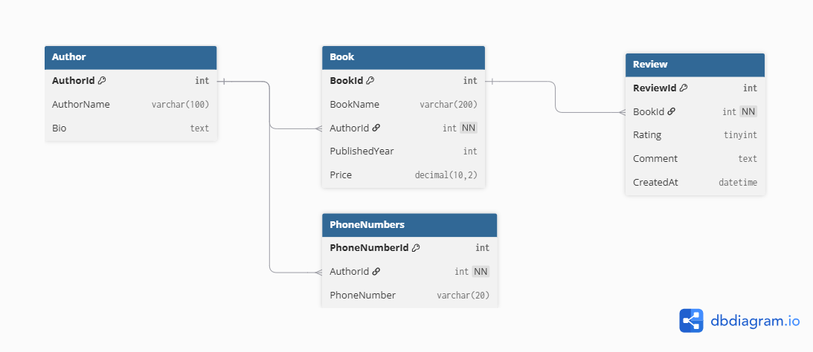

# Week 3 - Day 2
## Hands-On Lab: Database Design and Normalization

### Overview

This lab focuses on designing a normalized relational database for the **Library Management System** created during **Week 3 - Day 1**.

The database schema was designed following database normalization principles (1NF, 2NF, and 3NF), defining primary and foreign keys, creating an Entity Relationship Diagram (ERD), and selecting appropriate SQL data types for every attribute.

---

## Tasks Completed

### 1. Entity Identification

Designed the database around the following entities:

- Author
- Book
- Review
- PhoneNumbers

Each entity contains the required attributes based on the API resources designed in Day 1.

---

### 2. Database Normalization

Applied the first three normal forms:

- **1NF**
  - Removed the multi-valued **Phone** attribute from the **Author** table.
  - Created a separate **PhoneNumbers** table.

- **2NF**
  - Verified that all tables use single-column primary keys.
  - No partial dependencies exist.

- **3NF**
  - Verified that all non-key attributes depend only on their table's primary key.
  - No transitive dependencies exist.

---

### 3. Primary Keys & Foreign Keys

Defined:

#### Primary Keys

- AuthorId
- BookId
- ReviewId
- PhoneNumberId

#### Foreign Keys

- Book.AuthorId → Author.AuthorId
- Review.BookId → Book.BookId
- PhoneNumbers.AuthorId → Author.AuthorId

---

### 4. Entity Relationship Diagram (ERD)

The database schema was modeled using **dbdiagram.io**.

#### ERD Preview

#### Design Board

https://miro.com/welcomeonboard/THdybHRPMUZiTVRJeFhFQS9pL3U4THJkN21HOFZBaDkwRlVpTSt4aTArWm1ESU1aV1pBRDBoTGdZbm51UGFDY0pEY1JzdUpjekVpNlArMGFlZTNiWWFzMTFWZlh1VUl4SzV5SHEwdnA1bVExcnlxTUZVZXp3elNLL3d3N3lKVzF3VHhHVHd5UWtSM1BidUtUYmxycDRnPT0hdjE=?share_link_id=690515375790

---

### 5. SQL Data Types

| Table | Attribute | Data Type |
|--------|-----------|-----------|
| Author | AuthorId | INT |
| Author | AuthorName | VARCHAR(100) |
| Author | Bio | TEXT |
| Book | BookId | INT |
| Book | BookName | VARCHAR(200) |
| Book | AuthorId | INT |
| Book | PublishedYear | INT |
| Book | Price | DECIMAL(10,2) |
| Review | ReviewId | INT |
| Review | BookId | INT |
| Review | Rating | TINYINT |
| Review | Comment | TEXT |
| Review | CreatedAt | DATETIME |
| PhoneNumbers | PhoneNumberId | INT |
| PhoneNumbers | AuthorId | INT |
| PhoneNumbers | PhoneNumber | VARCHAR(20) |

**Note:**

The **Price** column uses **DECIMAL(10,2)** because it stores monetary values and requires fixed precision.

---

## Technologies Used

- SQL Server
- SQL Server Management Studio (SSMS)
- dbdiagram.io
- Miro

---

## Learning Outcomes

By completing this lab, I practiced:

- Identifying database entities and attributes.
- Applying database normalization (1NF, 2NF, and 3NF).
- Designing relational database schemas.
- Defining primary and foreign keys.
- Creating Entity Relationship Diagrams (ERDs).
- Selecting appropriate SQL data types.
- Designing a database before implementation using Entity Framework Core.

---

## Conclusion

The final database schema is fully normalized and ready for implementation in SQL Server. This design serves as the foundation for the upcoming Entity Framework Core and ASP.NET Core exercises in the following weeks.